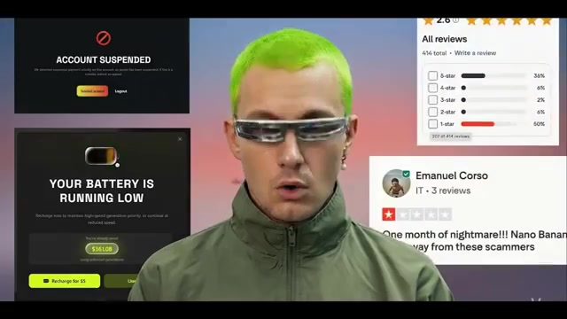
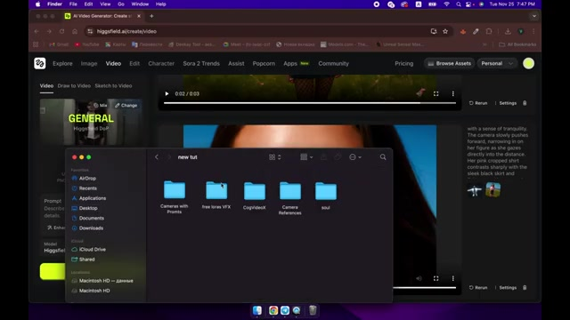
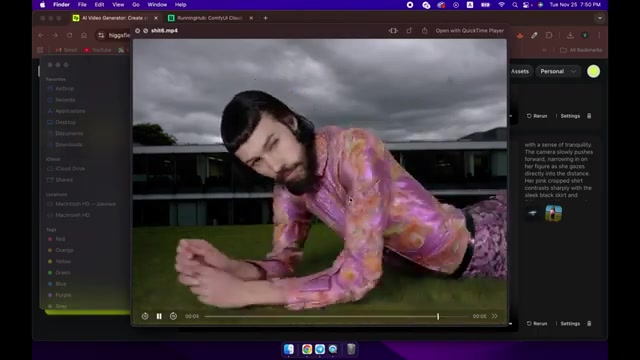
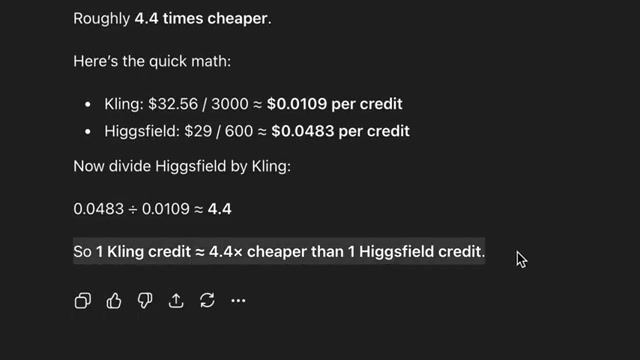
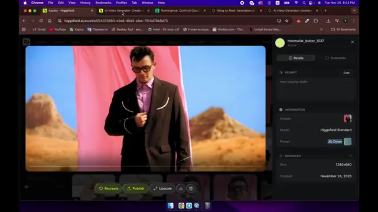
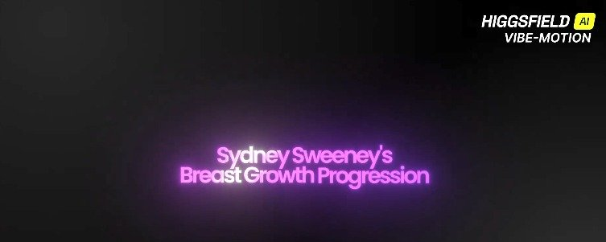

# Higgsfield AI Scam - Research & Documentation

A comprehensive collection of research, evidence, and documentation exposing alleged fraudulent practices, product misrepresentation, ethical violations, and consumer exploitation by Higgsfield AI.

---

## Table of Contents

- [The Subscription Scam & Mass Bans](#the-subscription-scam--mass-bans)
- [Product Quality Expose](#product-quality-expose)
- [Ethical Violations & Exploitation](#ethical-violations--exploitation)
- [Summary of Allegations](#summary-of-allegations)

---

## The Subscription Scam & Mass Bans

*Account suspensions, the "battery" throttle system, and Trustpilot backlash*

### The Bait: "Unlimited" Plans

*Higgsfield's "Nano Banana Pro 365 Unlimited - 80% OFF" Christmas pricing page*

Higgsfield offered unlimited creativity plans wrapped in Black Friday and holiday discounts. Thousands of creators purchased what they believed was an unlimited access tool. The promise: an annual subscription for "unlimited banana" featuring eight simultaneous generations.

### December 19th: The Blackout Begins

While the world was preparing for the holidays, Higgsfield unilaterally changed the rules. Without warning, the "unlimited dream" turned into a digital nightmare. The official Discord became a crime scene - searching the word "ban" revealed an overwhelming number of reports. From every corner of the globe, the story was the same: accounts frozen, access denied.

The bans dragged on for seven days in a slow-motion, systematic purge. Some users managed to file appeals. One creator from Spain waited 5 days for a resolution, only to be hit with a final refusal on Christmas Day.

### December 25-26th: Mass Account Purge

On the night between December 25th and 26th, the situation hit a breaking point. While users in Europe, Asia, and America had been getting picked off quietly, this night saw a total massacre of accounts with Russian IPs. The official excuse: "suspicious payment activity."

These weren't just warnings - these were total lockouts. Users were stripped of their accounts, unable to even download the work they had already generated. Higgsfield went completely radio silent with no official statements or comments.

### Employee Misconduct

Screenshots surfaced showing a Higgsfield employee pointing the finger at intermediaries, blaming them for the entire fallout. The same person gave users the middle finger and then denied being on the payroll. However, LinkedIn confirmed he was a partner at the company - denying his own company while insulting customers.

### Server Overload & Financial Reality

Evidence suggests Higgsfield's servers were buckling under the load. The math on the unlimited subscriptions didn't add up - the unlimited deals were bleeding the company dry. Rather than investing in infrastructure, they chose to purge their own paying users to cut costs.

### The "Battery" System: Killing Unlimited

The unlimited "banana" plan was killed. In its place, Higgsfield introduced the "battery" - a system designed to throttle usage:

1. **Original promise**: Unlimited plan with 8 simultaneous generations
2. **First cut**: Slashed to 4 simultaneous generations
3. **Final squeeze**: Choked down to 2 simultaneous generations
4. **The battery**: After using your "unlimited" plan for a while, you get locked out and hit with a restriction. Their solution? Pay an extra $5 to keep working. Refuse, and you're left waiting indefinitely.

### The Rigged Safety Filter

In unlimited mode, prompts get flagged and blocked for "safety violations." But the exact same prompt in paid mode passes instantly. This is a fake barrier designed to offload server costs and force users to pay more.

### User Rebellion & Fake Reviews

The fury was explosive. Users called for a total boycott and flooded Trustpilot with one-star reviews. Higgsfield's response: instead of investing in servers, they started buying fake positive reviews to drown out the backlash.

### Partial Unbanning & Damage Control

Under crushing public pressure, on December 27th Higgsfield began quietly unbanning accounts. The process was as chaotic and random as the purge itself. They restored the very users they had accused of fraud, proving their excuses about "shady intermediaries" were a smokescreen. They even unbanned people who hadn't filed a single appeal. However, the majority of banned accounts were never restored - not even half of the victims were brought back.

### The Moderator Whistleblower

On the night between December 27th and 28th, a moderator from Ukraine who had been on the front lines for days finally walked away. She had been forced to pedal company lies and manage the fallout under direct orders. Before leaving, she posted a raw, heartbreaking expose condemning the company's disgraceful treatment of users and straight up accusing them of fraud.

### Predatory Billing

On December 29th, users were caught in a predatory billing loop while trying to upgrade. Evidence shows one victim was slammed with five separate $39 invoices in a single day, with no refunds in sight.

### The Premeditated Long Con

The evidence suggests this wasn't a technical failure - it was a premeditated scheme:

1. **The Bait**: Unlimited Black Friday deals with predatory fine print
2. **The Hook**: Onboard a massive wave of paying users
3. **The Switch**: Change the rules and ban users the moment they start generating
4. **The Squeeze**: Slash speeds, introduce the battery, demand an extra $5 for access you already paid for

Add in months of forced annual subscriptions, unpaid contest prizes, and the motive becomes clear.

### Influencer Manipulation

Higgsfield reportedly engages in hit-and-run tactics with influencers. In one case, after an investigator dropped a two-part YouTube expose tearing them apart, Higgsfield actually contacted their inbox asking for an ad spot - demonstrating either incompetence or brazen disregard.

### Key Policy Concerns

1. **The Banhammer**: They can ban anyone, anytime, for any reason - and they already have
2. **The Refund Wall**: Refunds only apply to your first subscription within seven days, and only if you haven't used any credits. Renewals get no refunds, ever
3. **Data Harvesting**: Everything you upload becomes theirs. They use your work for training and ads without your permission

---

## Product Quality Expose

### Previous Testing Results

In prior testing, 10 out of 13 Higgsfield apps completely collapsed. The three that sort of worked were barely functional. Every single one lost to totally free tools.

### Camera Tools: "Legendary" Failures

*Higgsfield's interface during independent product testing*

Higgsfield markets their "DP camera tools" and "legendary camera moves" as their flagship feature. Here's what actually happens:

#### 360 Orbit
The face wobbles, the body melts, and the whole thing looks like it's been faxed three times through a potato. Not a 360 orbit - a "360 tour of facial destruction."

#### Tilt Up
A basic camera movement that instead applies what amounts to a face-distortion filter. Unusable for any client work.

#### Arc Right
The camera moves slightly and the face relocates to another dimension.

#### Super Dolly In
The closer the camera gets, the more the identity glitches frame by frame. Not a dolly in - a "witness protection program in motion."

#### Dolly Out
Free model: smooth, cinematic, totally usable. Higgsfield: quality drops to "2007 YouTube."

#### Zoom In
Free model: same girl, same features, same vibe throughout. Higgsfield: subjects change race midway through the shot. The subject starts as one person and halfway through becomes a completely different person.

#### Camera Pulls Back + Character Walks Forward
Free model: stable outfit, stable face, looks like a real shot. Higgsfield: tights glitch, mesh freaks out, legs turn into a geometry experiment.

#### Camera Up
Free model: clear, elegant, cinematic. Higgsfield: camera technically moves up, but the character goes straight to uncanny valley.

#### Deep Down / Dip Moves
Free model: logical camera glide, character stays normal. Higgsfield: artifacts everywhere - demon tights, cursed face, physics that don't make sense.

### Camera Tools Summary

*Higgsfield camera tool output: body and face distortion artifacts*

*Higgsfield generation showing severe face-melting artifacts*

Every time you touch their camera tools, the subject changes race, age, and sometimes gender mid-shot. They are not offering cinematic cameras for filmmakers - they're offering a random character generator with motion blur. Only about 1 out of 10 camera effects worked even remotely okay, and even when the camera worked, the faces melted, making results completely unusable.

### Effects & LoRAs: Repackaged Free Tools

Higgsfield proudly showcases explosions, vampires, angels, and dramatic effects. The reality:

- These LoRAs are **open-source** and available for free with a decent PC
- They can be run up to **100 times cheaper** on platforms like RunningHub
- The same effects are available through hundreds of free alternatives
- Both Higgsfield's paid effects and the free alternatives need face restoration, so there's no quality advantage to paying

#### Explosion Effects
- Free tool: strong blast, stable face, consistent identity, cinema-quality
- Higgsfield: decent explosion, but the character's face is instantly cursed

#### Vertical Explosions
- Free: usable, stylish, coherent
- Higgsfield: random new person appears in the shot

### The Biggest Reveal: They're Not Using Their Own Models

When examining Higgsfield's best-looking transitions and effects, investigation revealed they're not even using their own models:

- **Effects/Transitions**: Powered by **Kling 2.5 Turbo** (not Higgsfield)
- **Camera Moves**: Powered by **Minimax Hailuo 2.3** (not Higgsfield)

Their business model is essentially reselling other companies' technology under their own branding. Their signature camera tech is a "playlist of other people's models."

### The Price Markup

*Price breakdown: Kling credit costs $0.0109 vs Higgsfield at $0.0483 — a ~4.4x markup for the same underlying model*

After converting all Higgsfield subscriptions and credits into real money and comparing with Kling's direct pricing: **Higgsfield charges approximately 4.5 times more than using Kling directly** for the same underlying technology.

### Their Native Models Are Abandoned

*Higgsfield's own "Higgsfield Standard" model with "Jib Down" preset — native model quality remains unchanged*

It's been almost a year since launch and the quality of their native models is exactly the same. The only thing they invest energy into is marketing and scammy promises that mislead people.

### "Soul" Feature: Template Jail

Marketed as the ultimate poster creator with "infinite moods" and "infinite styles," the Soul feature is actually:
- One locked-in aesthetic with slightly different sliders
- One template with 20 mood filters
- "Preset prison with good UI"

The same results can be achieved for free by finding reference layouts on Pinterest and using character replacement workflows that maintain pose, lighting, and perspective.

### Free Alternatives That Actually Work

- **CogVideoX**: Effect copying - load a reference effect video, load your base image, describe what should happen, and get fluid effects, distortions, and smoke for free
- **Camera Copy / Robo Arm Workflows**: Take a video with a nice camera move, feed it in, and the AI copies the camera path and applies it to your subject. Smooth motion, no random face mutations
- **Character Replacement Workflows**: Replace characters in videos while maintaining consistency
- **Video Background Replacement**: Swap environments while keeping the subject
- **Face Restoration Workflows**: Fix face artifacts and upscale to full HD
- **Kling**: Direct access to the same model Higgsfield resells, at ~4.5x lower cost, plus lip sync capability
- **Minimax Hailuo**: Direct access to the same camera model Higgsfield resells
- **iCandy**: Free high-quality video references

### Final Verdict on Product Quality

- Camera tools break the subject almost every time you move the camera
- Effects and LoRAs are consistently worse than free alternatives
- Their coolest transitions and shots are powered by Kling, Minimax, and other external models - it's a "cosplay of other people's tech with their logo layered on top"
- Soul posters are one aesthetic trapped in a nice interface
- Rating: "One melted face, three stolen models, and a monthly subscription to disappointment"

---

## Ethical Violations & Exploitation

### 1. Non-Consensual Sexual Content

*Higgsfield's own Vibe-Motion branded content: "Sydney Sweeney's Breast Growth Progression" — non-consensual sexual objectification of a real actress*

This is alleged to be their core business model:
- Posted content titled "Sydney Sweeney's Breast Growth Progression" - a real actress, no consent, sexual objectification for engagement
- Generated real actors placed in sex scenes without consent
- Created content depicting rape scenarios
- Produced sexualized versions of children's movies including Pinocchio
- Countless other sexual deepfakes of real people

### 2. Systematic Evidence Deletion

When caught, they delete the evidence:
- The Charlie Kirk video was deleted
- Sexualized Pinocchio content was deleted (but copies were preserved)
- The pattern: generate exploitative content, farm engagement and virality, collect money, delete when heat comes

### 3. Internal Content Repository

Reports describe an internal drive containing a folder labeled "CPP" full of deepfakes of famous people depicted with down syndrome - including Zuckerberg, Trump, Musk, random interview subjects, and children's characters like Peppa Pig. These were deemed too extreme even for the company to post publicly.

### 4. Sexualization of Children's Content

They took Pinocchio, a children's movie, and produced sexual content from it featuring characters like Jeffrey Epstein. They are actively taking content meant for children and making it sexual, creating a pipeline that normalizes the sexualization of children's media.

### 5. Racist Deepfakes

They generate racist content that exploits racial stereotypes and harmful dynamics.

### 6. A Product Literally Named "Steal"

They created a feature and called it "Steal" - openly signaling their stance on consent, ownership, and ethics. Theft is the feature. Violation is the product.

### 7. "AI Is Destroying Your Jobs" Rage Bait

Their marketing strategy includes posting content like "AI DESTROYED REAL JOBS" to farm engagement from both sides, profiting off people's fear and anxiety about their livelihoods while contributing nothing but exploitation.

### 8. Predatory Addiction Mechanics

Every post follows casino psychology and mobile game addiction tactics:
- "For 12 hours ONLY: retweet for FREE credits!"
- "For 9 hours: Reply & Quote to claim in DMs!"
- "UNLIMITED with NO RESTRICTIONS!"

The "NO RESTRICTIONS" line explicitly advertises the ability to generate harmful content as a selling point. This is manufactured urgency and FOMO.

### 9. Documented History of Scams

They've been exposed before for scammy behavior. This is a pattern, not a one-time incident.

### 10. Influencer Complicity

Creators are promoting this company, taking sponsorships, retweeting posts, and providing legitimacy. When you promote Higgsfield, you are endorsing:
- Non-consensual sexual deepfakes of real actors
- Sexualized children's media
- Racist content
- A feature literally named "Steal"
- Predatory psychological manipulation
- "Job destruction" fear-mongering
- Documented scam behavior

---

## Summary of Allegations

| Category | Allegation |
|---|---|
| **Financial Fraud** | Sold unlimited plans, then mass-banned users to cut server costs |
| **Predatory Billing** | Users charged multiple times ($39 x 5 in a single day), no refunds |
| **Bait and Switch** | Unlimited plans replaced with throttled "battery" system requiring extra payment |
| **Fake Reviews** | Purchased positive Trustpilot reviews to suppress backlash |
| **Product Misrepresentation** | Best features secretly run on Kling 2.5 Turbo and Minimax Hailuo 2.3, not proprietary tech |
| **Price Gouging** | Charges ~4.5x more than using the underlying models directly |
| **Non-Consensual Sexual Content** | Deepfakes of real actors in sexual scenarios without consent |
| **Child Exploitation** | Sexualized versions of children's content (Pinocchio) |
| **Racist Content** | Deepfakes exploiting racial stereotypes |
| **Evidence Destruction** | Systematic deletion of controversial content when caught |
| **Rigged Systems** | Safety filter blocks unlimited users but passes identical prompts for paid users |
| **Data Harvesting** | User uploads used for training and ads without permission |
| **Predatory Marketing** | Casino-style addiction mechanics, manufactured urgency, fear-mongering |
| **Abandoned Technology** | Native models unchanged for almost a year, replaced by third-party models |

---

## Why This Matters

We are at a defining moment for AI technology. The norms we accept now will determine what this space becomes. If companies like Higgsfield operate without consequence, it sets a precedent that:

- Non-consensual sexual content of real people is acceptable if it gets engagement
- Sexualizing children's content is fine if it goes viral
- Consent doesn't matter when the technology enables violation
- Exploitation is acceptable if everyone's making money

The AI art community deserves better than companies that promote the worst in an emerging industry.

---

## Evidence Sources

- Independent YouTube investigations and video transcripts
- Official Higgsfield Discord community reports and screenshots
- Social media documentation with receipts
- Trustpilot review analysis
- Direct product testing and model comparisons
- Internal whistleblower testimony (Ukrainian moderator resignation)
- LinkedIn employment verification
- Pricing analysis comparing Higgsfield vs. direct model access (Kling, Minimax)
- Preserved copies of deleted content

---

## Resources

- [Higgsfield AI: A Company Built on Rage Bait Content, Stolen Likenesses, and Sexual Exploitation](https://x.com/BLVCKLIGHTai/status/2018762826190622805) — @BLVCKLIGHTai on X
- [Higgsfield AI Exposed: The Scam Behind the Hype (Don't Buy This)](https://www.youtube.com/watch?v=JlnUEU0P-d4) — Yaroflasher
- [Higgsfield's Unlimited Plan Scam Exposed | Final Chapter](https://www.youtube.com/watch?v=7Zj10P0Sa1k) — Yaroflasher

---

## Disclaimer

This repository contains research and allegations compiled from multiple independent sources. The content represents claims made by independent investigators, affected users, and former company insiders. Readers should review the evidence and form their own conclusions.
